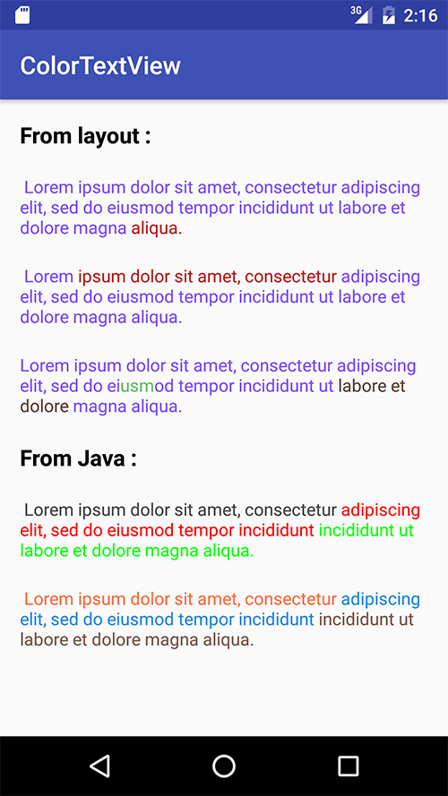

# ColorTextView

Change color of words into a TextView.

This library uses spannable strings to apply colors of the substring (no slow Html.fromHtml or other tricks/hacks)  

### Installation

	compile 'loic.teillard.colortextview:colortextview:1.0.0'

### Usage

1 - Include ColorTextView namespace to the root element :

	xmlns:colortextview="http://schemas.android.com/apk/res-auto"

2 - Add the ColorTextView with custom params :

	<loic.teillard.colortextview.ColorTextView
	android:layout_width="wrap_content"
	android:layout_height="wrap_content"
	colortextview:clt_txt1="Text"
	colortextview:clt_color1="@color/blue"
	/>

The color can be applied from XML or Java (please see sample for good examples) :

## XML

####  Supported Attributs

| XML Attribut         | Description  |Type|
| :-------------:| :-----:|:-----:|
| colortextview:clt_txt1| Text of the first part of text |String|
| colortextview:clt_color1|  Text color of the first part of text|String|
| colortextview:clt_txt2..10| Text of the next part of text |String|
| colortextview:clt_color2..10|  Text color of the next part of text|String|
| colortextview:clt_spaces |Add space between each text (words mode)|Boolean|

####  Example

	<loic.teillard.colortextview.ColorTextView
    android:layout_width="wrap_content"
    android:layout_height="wrap_content"
    colortextview:clt_spaces="true"
    colortextview:clt_color1="#5D4037"
    colortextview:clt_color2="#F4511E"
    colortextview:clt_txt1="Hello"
    colortextview:clt_txt2="world !"
    />
    
#####    Output
    

## Java

### Methods

| Function        | Description  |Comment|
| :-------------: |:-------------:| :-----:|
| addTextColor(String,int) | Add text with this color|Call it as many times you need to add strings
| addTextColor(int,int) | Add text with this color, both from Resources ID (ex : R.string.text, R.color.blue)|Call it as many times you need to add strings
| setSpaces(boolean) | Automatically add spaces between words|no need to add yourself (pass to false if you need to color substring inside a string)
| apply() | When ready, apply your parameters| |

#### Example

    ViewGroup layout = (ViewGroup) findViewById(R.id.layout);
    
    ColorTextView colorTextView = new ColorTextView(this);

    colorTextView.addTextColor("Hello", Color.parseColor("#5D4037"));
    colorTextView.addTextColor("world !", Color.parseColor("#F4511E"));

    colorTextView.setSpaces(true);

    colorTextView.apply();

    layout.addView(colorTextView);
    
#####    Output
    
    